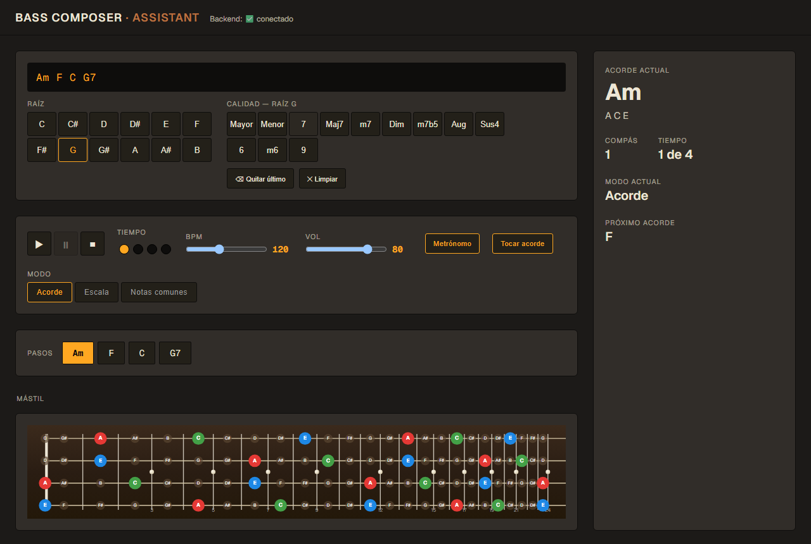
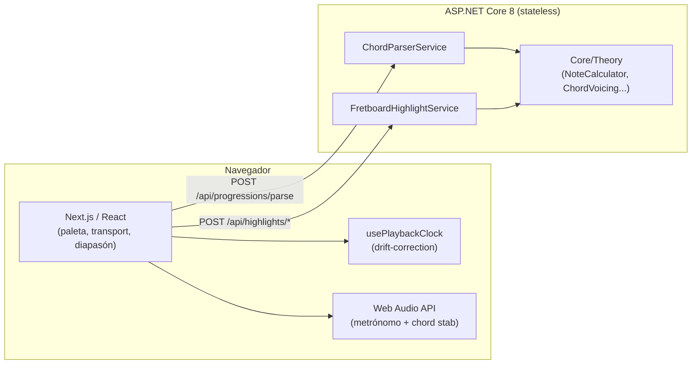

# 🎸 Bass Composer Assistant — Web

Herramienta para bajistas: armá una progresión de acordes a clicks, reproducila contra un
metrónomo, y mirá qué notas tocar en un diapasón de 24 trastes — en modo Acorde, Escala o Notas
Comunes. Versión web (ASP.NET Core 8 + Next.js) de
[Bass Composer Assistant](https://github.com/TintoUriel/Bass-Composer-Assistant), la app de
escritorio original (WPF/.NET 8).

[](https://bass-composer-assistant-web.vercel.app)
[](https://vercel.com)
[](https://render.com)
[](https://dotnet.microsoft.com/)
[](https://nextjs.org/)
[](LICENSE)



**👉 Probala ahora: https://bass-composer-assistant-web.vercel.app**

> El backend gratuito (Render) se duerme tras 15 min sin uso — el primer request puede tardar
> ~30-60s en responder mientras arranca de nuevo. Es normal, no es un bug.

---

## Índice

- [Qué hace](#qué-hace)
- [Stack](#stack)
- [Arquitectura](#arquitectura)
- [Correrlo en local](#correrlo-en-local)
- [Probar la app a mano](#probar-la-app-a-mano)
- [Tests](#tests)
- [Deploy / CI-CD](#deploy--cicd)
- [Estructura del repo](#estructura-del-repo)
- [Roadmap y decisiones](#roadmap-y-decisiones)

## Qué hace

- **Armar progresiones por clicks**, no por tipeo: paleta de raíz (C..B) + calidad (Mayor, Menor,
  7, Maj7, m7, Dim, m7b5, Aug, Sus4, 6, m6, 9).
- **Transport con metrónomo**: play/pause/stop, BPM 40–240, volumen, avance automático de
  compás/tiempo, loop. El BPM se puede cambiar en medio de la reproducción sin romper el timing
  (reloj con corrección de drift vía `performance.now()`).
- **Mute de metrónomo** y **toggle de sonido de acorde**, independientes entre sí — ambos
  sintetizados en el momento con Web Audio API, sin assets de audio.
- **3 modos de visualización** en el diapasón (24 trastes, 4 cuerdas, separación no lineal real):
  - **Acorde** — notas del acorde actual.
  - **Escala** — escala sugerida para el acorde actual.
  - **Notas comunes** — intersección de las notas de *toda* la progresión cargada, para
    improvisar sobre el conjunto completo.
- **Timeline de progresión** con click-to-jump: saltar a cualquier acorde, en play o en pausa.
- **Panel de info**: acorde actual + notas, compás, tiempo, modo, escala sugerida, próximo acorde.

## Stack

| Capa | Tecnología |
|---|---|
| Backend | ASP.NET Core 8 Minimal API, stateless |
| Frontend | Next.js (App Router) + React + TypeScript |
| Audio | Web Audio API (síntesis en el momento, sin assets) |
| Tests | xUnit (backend), Vitest + React Testing Library (frontend) |
| Hosting | Vercel (frontend) + Render (backend, Docker) |

## Arquitectura

El estado de reproducción (BPM, beat actual, acorde actual, modo) vive **100% en el cliente**. El
backend es completamente *stateless*: solo parsea progresiones y calcula teoría musical / mapas
de highlights por request — sin sesiones, sin WebSockets, sin metrónomo corriendo en el servidor.

La teoría musical (notas, acordes, escalas, fretboard) viene portada 1:1 del repo desktop
(`Core`/`Services`), copia congelada en un commit puntual, no referenciada — ver
[CLAUDE.md](CLAUDE.md) para el detalle completo de qué se reusó, qué se reescribió, y por qué.



## Correrlo en local

### Requisitos

- .NET SDK 8
- Node.js 18+ y npm

### 1. Backend

```bash
cd api/BassComposerAssistant.Api.Web
dotnet run
```

Queda en `http://localhost:5163` (también `https://localhost:7202`). Verificar:

```bash
curl http://localhost:5163/api/health   # -> ok
```

Swagger UI en `http://localhost:5163/swagger` (solo en Development).

### 2. Frontend

En otra terminal:

```bash
cd frontend
npm install   # solo la primera vez
npm run dev
```

Queda en `http://localhost:3000`. El header de la app muestra "Backend: ✅ conectado" si el fetch
al API funcionó. Apunta a `http://localhost:5163` por defecto (`lib/api.ts`) — para otro puerto,
seteá `NEXT_PUBLIC_API_BASE_URL` en `frontend/.env.local`.

> **Windows + PowerShell**: si `npm install`/`npm run dev` tira `UnauthorizedAccess` / "la
> ejecución de scripts está deshabilitada", es la política de ejecución de PowerShell, no el
> proyecto. Arreglo rápido: `npm.cmd install` / `npm.cmd run dev`. Arreglo permanente (una vez):
> `Set-ExecutionPolicy -Scope CurrentUser RemoteSigned`.

## Probar la app a mano

Con ambos corriendo, en `http://localhost:3000`:

1. **Armar una progresión**: clickear una raíz y después una calidad (ej. "A" + "Menor" agrega
   "Am"). "⌫ Quitar último" sacar el último acorde, "✕ Limpiar" vacía todo.
2. **Reproducir**: ▶ arranca el metrónomo y avanza de acorde automáticamente (1 compás = 4
   tiempos), ⏸ pausa, ■ detiene y vuelve al primer acorde/tiempo 1.
3. **Modo** (Acorde / Escala / Notas comunes): cambia qué se resalta en el diapasón. Si "Notas
   comunes" no resalta nada, es porque ningún pitch class es común a *todos* los acordes — es
   esperado, no un bug.
4. **Pasos** (timeline): clickear cualquier chip de acorde salta la reproducción ahí, esté
   corriendo o en pausa.

### Cosas que necesitan oído/ojo humano (no automatizables)

- Si el click de metrónomo y el "stab" del acorde sintetizado suenan bien/reconocibles.
- Si el color teal de "Notas comunes" se ve bien contra el fondo oscuro del diapasón.
- Desbloqueo de `AudioContext` por gesto del usuario en distintos navegadores — si no se escucha
  nada al apretar play, probar clickear cualquier botón antes.

## Tests

```bash
# Backend — Core + Services, 68 tests
cd api/tests/BassComposerAssistant.Tests
dotnet test

# Frontend — Vitest + React Testing Library
cd frontend
npm run test
```

## Deploy / CI-CD

Ambas mitades se redeployan solas con cada push a `master`:

- **Frontend → [Vercel](https://vercel.com)**: conectado directo al repo, build automático por
  push, preview URL por PR.
- **Backend → [Render](https://render.com)**, gratis, vía Docker. El repo trae listo
  `api/Dockerfile` y `render.yaml` (Blueprint). Para crear el servicio desde cero:

  1. [render.com](https://render.com) → **New +** → **Web Service** (o **Blueprint**, si está
     disponible, que lee `render.yaml` solo).
  2. Conectar este repo, autorizando la GitHub App de Render.
  3. **Root Directory**: `api/` · **Dockerfile Path**: `api/Dockerfile` · **Plan**: Free.
  4. Variables de entorno: `ASPNETCORE_ENVIRONMENT=Production` y
     `AllowedOrigins__0=https://bass-composer-assistant-web.vercel.app` (CORS).
  5. **Health Check Path**: `/api/health`.
  6. Copiar la URL resultante (`https://....onrender.com`) y setearla como
     `NEXT_PUBLIC_API_BASE_URL` en las env vars de producción del proyecto de Vercel → redeploy.

## Estructura del repo

```
api/
  BassComposerAssistant.Api.Web/   ASP.NET Core 8 Minimal API (puerto 5163)
  BassComposerAssistant.Core/      teoría musical, copiado del repo desktop
  BassComposerAssistant.Services/  parseo/escalas/highlights, copiado del repo desktop
  Dockerfile                       multi-stage build para Render
  tests/BassComposerAssistant.Tests/
frontend/
  app/page.tsx                     única página, "use client"
  components/                      ChordPalette, TransportControls, Fretboard, etc.
  context/PlaybackContext.tsx      estado de reproducción (BPM, beat, modo, etc.)
  hooks/usePlaybackClock.ts        reloj con drift-correction (performance.now())
  lib/audio/                       síntesis Web Audio API (metrónomo + chord stab)
  lib/api.ts                       cliente HTTP hacia el backend
render.yaml                        Render Blueprint
```

## Roadmap y decisiones

El detalle completo de qué se portó del repo desktop, qué se reescribió y por qué, el diseño de
cada endpoint, y las fases de migración están en [CLAUDE.md](CLAUDE.md) — es el roadmap que guió
esta migración, escrito antes de tocar código.

Fuera de alcance v1 (heredado del repo desktop): 5/6 cuerdas, MIDI in/out, backing tracks,
grabación, export de progresión, detección automática de tonalidad, IA. Específico de la versión
web: autenticación/persistencia de progresiones guardadas, mobile-first, SSR/SEO, testing visual
automatizado.
